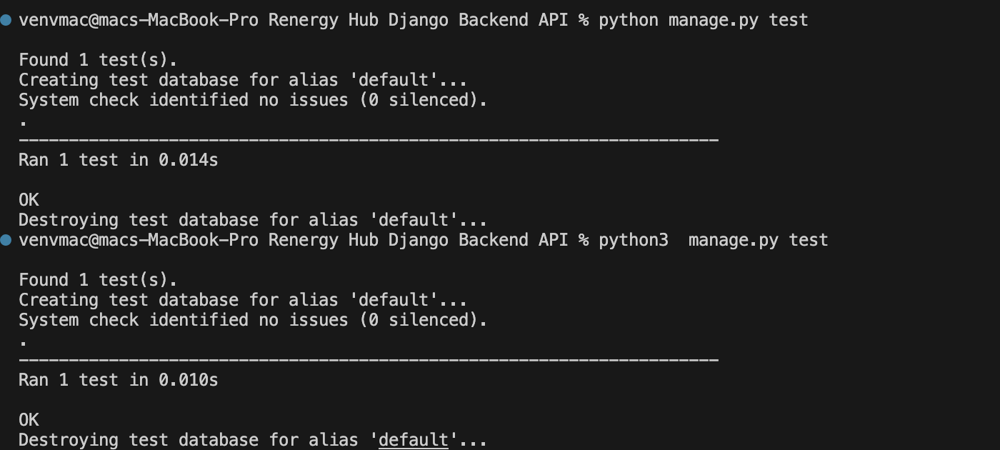

# E-commerce Marketing_Analytics Service

A Django-based service for tracking and analyzing cart abandonment rates in an e-commerce platform. This app provides REST API endpoints for querying analytics and offers a robust backend for monitoring marketing and conversion performance.

---

## Features

- **Cart Abandonment Rate**: Tracks how many users add products to their cart but leave without completing the purchase.
- **REST API**: Exposes endpoints for querying cart abandonment rates.
- **Database Models**: Includes models for managing products, carts, and cart items.

---

## API Endpoints

### Base URL: `http://127.0.0.1:8000/api/v1/cart-abandonment-rate/`

| Endpoint                 | Method | Description                                  |
|--------------------------|--------|----------------------------------------------|
| `/marketing_analytics/abandonment` | GET    | Fetch cart abandonment rate for a time range.|

---

## Usage

1. Add products and carts using the Django Admin panel or API endpoints.
2. Track cart and item activities.
3. Use the `/marketing_analytics/abandonment` endpoint to fetch abandonment analytics.

---

---
## test results

---
